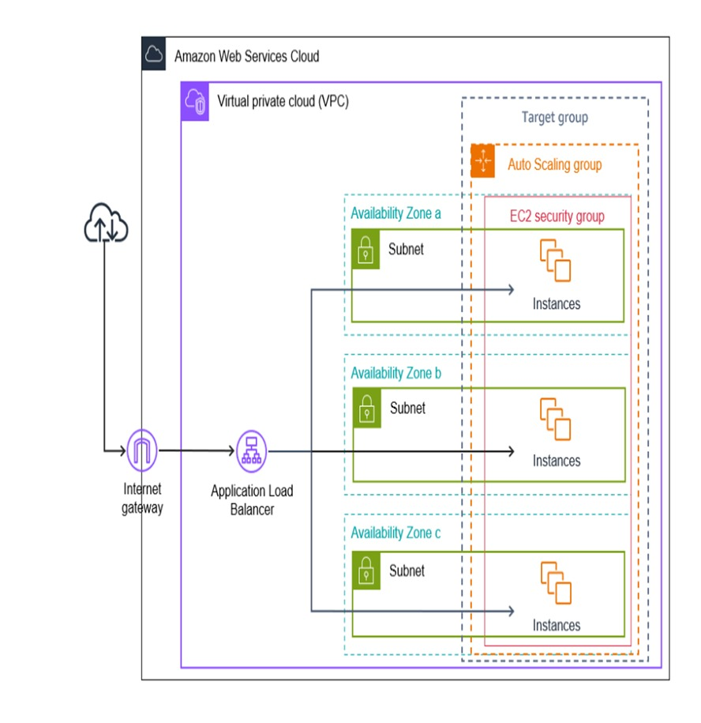

# AWS Infrastructure Deployment with Terraform

## Overview

This repository contains Terraform code to deploy a scalable and highly available infrastructure on AWS. The architecture includes the following AWS services:

- Amazon EC2 Instances: Distributed across multiple availability zones.
- Application Load Balancer (ALB): Distributes incoming traffic to EC2 instances.
- Auto Scaling Group: Automatically adjusts the number of EC2 instances based on demand.
- Subnets: Deployed in three availability zones for high availability.
- VPC (Virtual Private Cloud): Provides isolation and secure access.
- Security Groups: Controls inbound and outbound traffic for the instances.

## Architecture Diagram



## Components

1. Virtual Private Cloud (VPC): A logically isolated network defined for the application.
2. Subnets: Three subnets deployed in different availability zones.
3. Application Load Balancer: Distributes HTTP traffic across multiple EC2 instances.
4. Auto Scaling Group: Automatically scales the number of instances based on traffic.
5. Security Groups: Ensures secure access to instances by limiting traffic.

## Prerequisites

- Terraform v1.9.4 or higher
- AWS CLI
- AWS Account with appropriate permissions (EC2, VPC, Auto Scaling, Load Balancer)
- SSH Key Pair (to access instances if needed)

## How to Use

### 1. Clone the repository
```bash
git clone https://github.com/your-repo/aws-terraform-deployment.git
cd aws-terraform-deployment
```
### 2. Update Variables
Modify the variables in the variables.tf file to match your environment. Ensure your region, instance type, and other settings are configured.

### 3. Initialize Terraform
Run the following command to initialize your working directory containing Terraform files:
```bash
terraform init
```
### 4. Plan the Deployment
Execute a Terraform plan to check what resources will be created:
```bash
terraform plan
```
### 5. Apply the Terraform Plan
Deploy the infrastructure by running:
```bash
terraform apply
```
### 6. Destroy the Infrastructure
To remove all resources created by Terraform, run:
```bash
terraform destroy
```
## Outputs

After the successful deployment, Terraform will provide the following outputs:

- ALB DNS Name: Use this to access your application.


## License

This project is licensed under the MIT License - see the LICENSE file for details.
